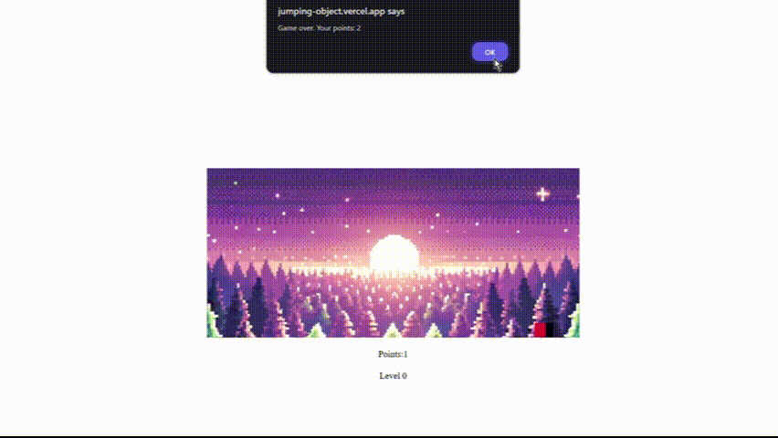

# Jumping Object  

Jumping Object is a simple browser game where the player controls an object that jumps over obstacles using the **"W"** key. The game features a dynamic level system and a randomly changing background, adding variety to the gameplay.  

## Game Rules  
- Control the object using the **"W"** key to make it jump.  
- The game level increases every **10 points**.  
- If the **black object** touches the **red object**, the game ends, and both the score and level are reset.  
 

## Technologies  
The game was created using:  
- **JavaScript** – game logic  
- **CSS** – styling and animations  

## Play the Game  
[Play Jumping Object](INSERT_GAME_LINK_HERE)  

e  
